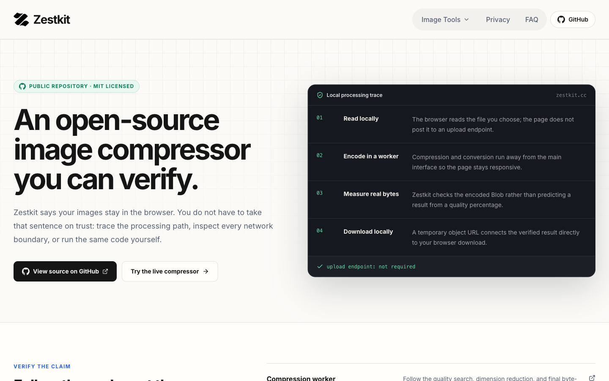

<div align="center">
  
  <h1>Zestkit</h1>
  <p><strong>Free, privacy-first image tools that run entirely in your browser.</strong></p>
  <p>No uploads · No account · Exact file-size verification · MIT licensed</p>
  <p>
    <a href="https://zestkit.cc/compress-image-to-100kb"><strong>Try Zestkit</strong></a>
    ·
    <a href="https://zestkit.cc/open-source">How privacy is verified</a>
    ·
    <a href="CONTRIBUTING.md">Contribute</a>
  </p>
</div>



## Why Zestkit

Most “compress to 100KB” tools estimate the result or require an upload. Zestkit performs the work locally and measures the actual encoded `Blob` before it exposes a download.

- **Exact output-size verification** — successful results are checked against the selected byte limit.
- **Local browser processing** — compression and conversion run in Web Workers without a Zestkit image-upload API.
- **No account or payment** — open a tool and use it immediately.
- **Preserves the source format** — JPG stays JPG, PNG stays PNG, and WebP stays WebP during compression.
- **Honest failure states** — the interface does not create a download when the browser encoder cannot meet the target.
- **Open source** — inspect the complete processing path or run the same code yourself.

## Live tools

| Tool | Live page |
| --- | --- |
| Compress Image to 20KB | [Open tool](https://zestkit.cc/compress-image-to-20kb) |
| Compress Image to 100KB | [Open tool](https://zestkit.cc/compress-image-to-100kb) |
| Compress Image to 200KB | [Open tool](https://zestkit.cc/compress-image-to-200kb) |
| Compress Image to 1MB | [Open tool](https://zestkit.cc/compress-image-to-1mb) |
| Compress Image to 2MB | [Open tool](https://zestkit.cc/compress-image-to-2mb) |
| Image Format Converter | [Open tool](https://zestkit.cc/image-format-converter) |

## How exact-size compression works

```text
Read and validate the image locally
              ↓
Encode at the original dimensions in a Web Worker
              ↓
Measure the actual output Blob
              ↓
Reduce quality, then dimensions only when required
              ↓
Verify the final byte size and source format
              ↓
Create a temporary local download URL
```

JPG and WebP compression searches for the highest usable encoding quality before dimensions are reduced. PNG keeps lossless encoding and transparency, so dimensions may need to change sooner. Animated PNG and WebP files are rejected instead of silently losing animation frames.

## Run locally

```bash
git clone https://github.com/Barry5753/Zestkit.git
cd Zestkit/web
pnpm install
pnpm dev
```

Open <http://localhost:3000/compress-image-to-100kb>.

The app uses Webpack for local and production builds because non-ASCII parent-directory names can trigger a Turbopack path panic. This does not change browser runtime behavior.

## Project structure

```text
Zestkit/
├── web/
│   ├── src/app/          # Next.js routes and metadata
│   ├── src/components/   # Tool interfaces and shared site UI
│   ├── src/lib/          # Validation and worker job control
│   └── src/workers/      # Compression and conversion workers
├── CONTRIBUTING.md
└── LICENSE
```

## Production configuration

`NEXT_PUBLIC_SITE_URL` controls canonical URLs, Open Graph URLs, `robots.txt`, and `sitemap.xml`. It defaults to `https://zestkit.cc`; set a different public origin when deploying your own copy.

```bash
NEXT_PUBLIC_SITE_URL=https://your-domain.example
```

## Contributing

Focused bug fixes, accessibility improvements, documentation, and image-processing improvements are welcome. Read [CONTRIBUTING.md](CONTRIBUTING.md) before opening a pull request.

## License

Zestkit is available under the [MIT License](LICENSE).
